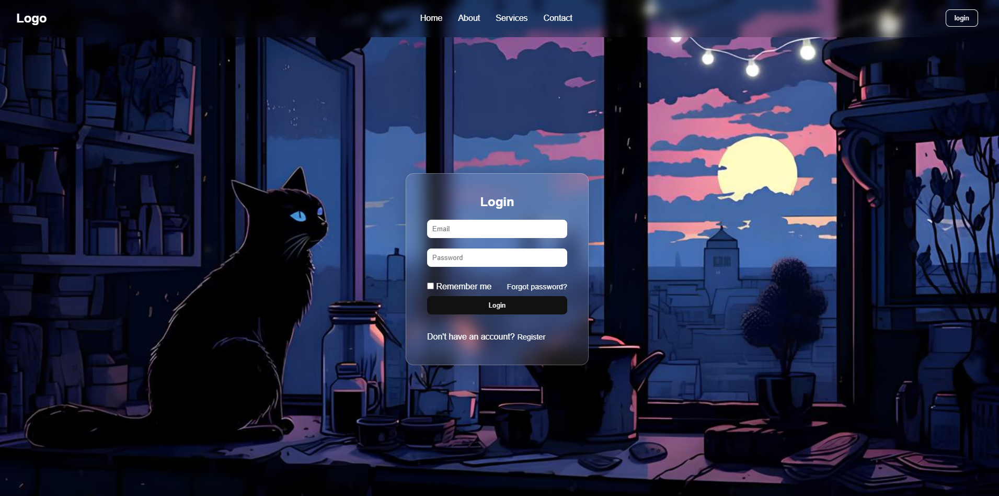

# 🖤 Black Cat Login Page

Halaman login estetis bergaya dark mode dengan nuansa kucing hitam misterius dan desain glassmorphism. Dibuat menggunakan **HTML dan CSS**, cocok untuk latihan UI/UX atau portfolio front-end.

## 🔍 Fitur

- Tampilan login dengan background "black cat"
- Header navigasi dengan link dan tombol login
- Form login berisi:
  - Input email & password
  - Checkbox "Remember me"
  - Link "Forgot password?"
  - Tombol Login
- Desain responsif dan clean
- Efek **glassmorphism** modern

## 📁 Struktur Proyek

<pre><code>
📦 black-cat-login/
├── index.html # Halaman utama
├── style.css # Styling halaman
└── background black cat.jpg # Gambar latar belakang
</code></pre>

## 🚀 Cara Menjalankan

1. Download atau clone repo ini.
2. Buka file `index.html` di browser (double click aja).
3. Done! Halaman login akan tampil dengan gaya kece.

## 📸 Preview

*Pastikan file gambar tidak dipindah atau diganti nama ya biar background tampil sempurna.*

## ⚠️ Catatan

- Belum terhubung ke backend (hanya tampilan)
- Cocok untuk latihan desain atau UI presentation
- Bebas dikembangkan jadi project yang lebih kompleks!

## ✍️ Author

Created with 💻 + ☕ by Syifa Fauziyah Arizal