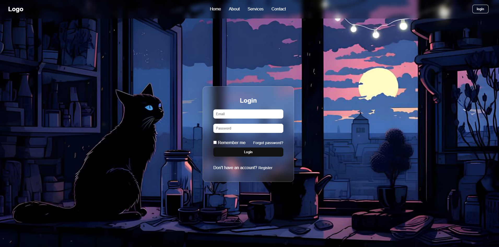

# 🖤 Black Cat Login Page

An aesthetically pleasing dark mode styled login page with a mysterious black cat theme and glassmorphism design. Built using **HTML and CSS**, perfect for UI/UX practice or front-end portfolio.

## 🔍 Features

- Login interface with elegant "black cat" background
- Navigation header with links and login button
- Comprehensive login form containing:
  - Email input field
  - Password input field
  - "Remember me" checkbox option
  - "Forgot password?" link
  - Login submission button
- Fully responsive and clean design
- Modern **glassmorphism** effects
- Smooth hover animations and transitions
- Cross-browser compatibility

## 🛠️ Technologies Used

- **HTML5** for semantic markup
- **CSS3** for advanced styling including:
  - Flexbox for layout
  - CSS custom properties (variables)
  - Backdrop filters for glassmorphism effect
  - Media queries for responsiveness

## 📁 Project Structure

<pre><code>
📦 black-cat-login/
├── index.html # Main HTML document
├── style.css # Complete styling for the page
├── background-black-cat.jpg # Background image asset
└── README.md # Project documentation
</code></pre>

## 🚀 How to Run the Project

1. Download or clone this repository to your local machine
2. Ensure all files are kept in the same directory (especially the background image)
3. Open the `index.html` file in any modern web browser (simply double-click the file)
4. The login page will render with the complete design

Alternative method using local server (for development):
1. Navigate to the project directory in your terminal/command prompt
2. Run a local server (e.g., `python -m http.server 8000` or `php -S localhost:8000`)
3. Open your browser and visit `http://localhost:8000`

## 📸 Preview

*Note: Make sure the background image file remains in the same directory and is not renamed to ensure proper display.*

## 🎨 Customization Guide

You can easily customize this login page by:

1. **Changing colors**: Modify the CSS custom properties in the `:root` selector
2. **Replacing background**: Swap the `background-black-cat.jpg` with your own image
3. **Adjusting glass effect**: Modify the `backdrop-filter` and `background` properties in the `.glass` class
4. **Adding functionality**: Connect to a backend service for authentication

## ⚠️ Important Notes

- This is a front-end only implementation with no backend functionality
- Perfect for UI design practice, portfolio pieces, or learning CSS techniques
- Feel free to extend and develop into more complex projects
- No frameworks or libraries required - pure HTML and CSS

## 🔮 Future Enhancements

Potential improvements for this project:
- Add form validation with JavaScript
- Implement dark/light mode toggle
- Create register page with similar design
- Add social media login options
- Make form fields more accessible with ARIA labels

## ✍️ Author

Created with 💻 + ☕ by SICODER .

## 📄 License

This project is open source and available under the [MIT License](LICENSE).